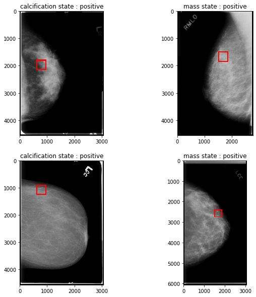

# BRESAT_TUMOR_DETECTION
## Description
- This repository describes the steps followed to train and test a CNN machine learning model for breast tumour detection.
- The repository is written in Python but integrated inside a jupyter notebook to improve visualization.
- Two pretrained models are used here, RESNET50 of Keras and RESNET18 of pytorch, where transfer learning was applied to fit our application needs.
- Accuracy got was: 97% train accuracy VS 80% test accuracy on Keras model which can be seen as overfitting, and 93% train accuracy VS 88% test accuracy on Pytorch model which is accepted.
- To be able to detect the location of the tumour and not only classify the mommogram, I wrote an algorithm capable of splitting the mommogram into subimages of 299px*299px, predict the presence of tumour on each one than select the one with higher probability to be displayed on user screen with a red square. Please check the sample below or check the DATA_VISUALIZATION.ipynb script.
- This algorithm detect only one tumour in case there is more than one but this was in purpose to have more reliable predictions and prevent user from false positive classification.
- Dataset are not provided in this repositories, but if you are interested you can contact me.

